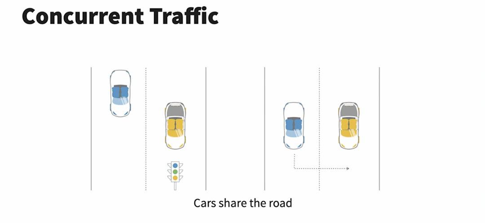
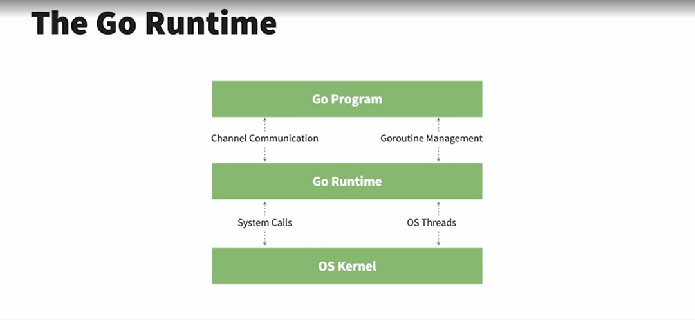
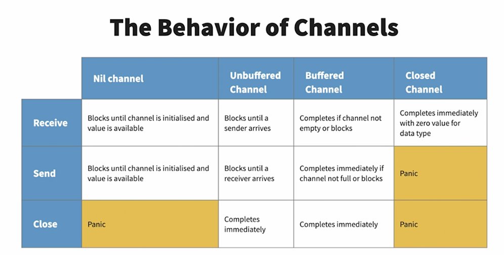

## Applied Concurrency in Go

### HTTP request/response cycle

On the internet, information is mostly exchanged via HTTP. The exchange begins with the client sending out an HTTP
request to the server to ask for information. If the server recognizes the request, it begins processing it by invoking
any backend code required to fulfill the request. The invoked functions are typically called _request handlers_. Once
the backend processing completes, the server finishes the information exchange by wrapping the information into an HTTP
response and sending it back to the client.

### Concurrency vs. Parallelism

**Parallel** events or tasks execute simultaneously and independently. True parallel events require multiple CPUs. Each
task runs in isolation from each other and uses all the resources it needs to accomplish its objective.


**Concurrent** tasks or events are interleaving and can happen in any given order. It is a non-deterministic way of
achieving multiple tasks. Concurrent tasks seem to happen simultaneously while in actual sense, they are being swapped
very quickly.



#### Examples of concurrent tasks in a typical computer

1. Running of background tasks for updates
2. Running the operating system
3. Writing information to the disk
4. Reading information from the disk
5. Swapping between multiple active applications

| Concurrency   | Parallelism   |
|---|---|
|  Dealing with a lot of things at once | Doing a lot of things at once   |
| Only a single thing is done at a time  |  Multiple things are done at the same time |
| Other new tasks are run during the idle periods of other running tasks  |  The tasks run independently and do not influence each other |

### The Go Runtime

In Go, concurrent tasks are called _goroutines_. Other programming languages have a similar concept called _threads_,
but goroutines require **_less computer memory_** than threads, and _**less time to start up and stop**_, meaning you
can run more goroutines at once.



#### Goroutines Exercise

In executing the `serialtaskexecution` without goroutines, the following output was realized:

- Linear serial task execution

````text
Done making hotel reservation.
Done booking flight tickets.
Done ordering a dress.
Done paying Credit Card bills.
Wrote 1/3rd of the mail.
Wrote 2/3rds of the mail.
Done writing the mail.
Listened to 10 minutes of audio book.
Done listening to audio book.
````

- Serial task execution using `goroutines`

However, when goroutines was used, the following output was realized:

````text
Done making hotel reservation.
Done booking flight tickets.
Done ordering a dress.
Done paying Credit Card bills.
Wrote 1/3rd of the mail.
Listened to 10 minutes of audio book.
````

This is because `goroutines` are not waited upon. The code in the `main` function continues executing and once the
control flow reaches the end of the main function, the program ends.

- Task execution using `sync.waitGroup`

When a `waitGroup` was used, the following output was realized (one of the possible ones).
`continueWritingMail1` and `continueWritingMail2` were executed at the end after `listenToAudioBook`
and `continueListeningToAudioBook`

```text
Done making hotel reservation
Done booking flight tickets
Done ordering a dress
Done paying Credit Card bills
Wrote 1/3rd of the mail.
Listened to 10 minutes of audio book.
Done listening to audio book.
Wrote 2/3rds of the mail.
Done writing the mail.
```

Adding `go` in-front of `task(&waitGroup)` enables the achievement of maximum concurrency by letting Go runtime
determine the order of execution of the tasks.

### Goroutines

These are independently executing functions that run on top of normal threads but lighter. They are therefore sometimes
referred to as `lightweight threads`.

1. They are independently executing functions
2. Sometimes referred to as lightweight threads
3. Run on top of threads
4. Outnumber threads by orders of magnitude
5. Runtime optimally schedules goroutines

### Methods of the sync.WaitGroup

The `sync` package provides locks and synchronization primitives for use in concurrent programming. The WaitGroup is
used to wait for a collection of goroutines to finish.

```go
func (wg *WaitGroup) Add(delta int)
func (wg *WaitGroup) Done()
func (wg *WaitGroup) Wait()
```

- `Add` adds a given number to the inner counter
- `Done` decrements the counter by 1 and is used to denote the completion of a goroutine
- `Wait` blocks the goroutine from which it is invoked until the counter reaches zero

NB: A good practice is to invoke the `Done` method as a deferred call at the beginning of the function to ensure it is
called.

### Race conditions

- Race conditions occur when multiple goroutines read and write shared data without synchronization mechanisms.
- Race conditions create inconsistent results
- Problems often occur with a `check-then-act` operation.
- Go toolchain has a built-in race detector.

```text
go run -race server.go
```

### Synchronization primitives in Go

- Channels
- Mutexes
- r/w mutexes
- atomic operations

#### The sync.Map

- Safe for concurrent use by multiple goroutines
- Equivalent to a safe ```map[interface{}]interface{}```
- The zero value is empty and ready for use
- Incurs [performance](https://medium.com/@deckarep/the-new-kid-in-town-gos-sync-map-de24a6bf7c2c) overhead and should
  only be used as necessary

##### Using the sync.Map

  ```go
  func (m *Map) Load(key interface{}) (value interface{}, ok bool)
func (m *Map) Store(key, value interface{})
func (m *Map) Range(f func (key, value interface{}) bool)
  ```

- The `Load` method reads an existing item from the map and returns nil and false when value does not exist
- The `Store` method inserts or updates (upserts) a new key value pair
- The `Range` method which takes in a function and sequentially calls it for all the values in the map

#### The sync.Mutex

- The Mutex is initialized unlocked using `var m sync.Mutex`

  ```go
  func (m *Mutex) Lock()
  func (m *Mutex) Unlock()
  ```

- The `Lock` method locks the Mutex and will block until the Mutex is in an unlocked state The `Unlock` method unlocks
  the Mutex and allows it to be used by another goroutine

### Channels

- Channels are the pipes that connect concurrent goroutines. You can send values into channels from one goroutine and
  receive those values into another goroutine.
- The value proposition of `channels` in Go is that there is no need to pass values to the shared context of the main
  function. The channel acts as a pass-through.
- Channels is Go are first-class citizens and therefore can be used without importing any extra packages.
- The channel operator is the arrow operator `<-`.
- Channels are associated with a type and only the declared data type can be transported in them. The syntax to declare
  a channel of type T is ```ch := make(chan T```
- The zero value of channels is `nil`.
- Sending to a channel is done with `ch <- data`; the arrow points into the channel as data travels into it.
- Receiving is done with `data := <- ch` ; the arrow points away from the channel as data travels out of it.
- Channels send and receive operations are blocking; meaning that code execution will stop until the send or receive
  operation is successfully completed.


#### Channel buffering

- By default, channels are *unbuffered*, meaning that they will only accept sends (chan <- ) if there is a corresponding
  receive (<- chan) ready to receive the sent value.
- _Unbuffered channels_ are zero capacity channels which require both the sender and the receiver to be present to
  successfully complete operations.
- _Buffered channels_ accept a limited number of values without a corresponding receiver for those values. The channel
  below, for instance, will accept upto 3 values even without a receiving channel.
- Channels can therefore be used to support synchronous (unbuffered channels) and asynchronous (buffered channels)
  communication.
- One of the benefits of buffered channels is that they can act as a cheap in-memory queue thus decoupling producers
  from consumers.

  ```go
  messages := make(chan string, 3)
  ```

#### Channel directions

- Channels can either be unidirectional or bidirectional. Unidirectional channels can be `receive only` channels (<-chan
  T) or `send only` channels (chan<- T)
- It is a recommended practice to use unidirectional channels as they provide a very clear expectation of a channel's
  expected usage and provide type safety to our programs. They also help avoid confusion to other future engineers
  extending our code.

#### Closing channels

- Closing channels signals that no more values will be sent on it. The syntax for closing a channel is as shown below:
  ```go
  close(ch)
  ```
- Only bidirectional and send only channels can be closed. Attempting to close a `receive only` channel would case a
  compilation error.
- Senders panic when sending to a closed channel.
- Receivers immediately receive the zero value of the channel data type from a closed channel. This means that without
  checking whether a nil value came from a closed or open channel, it is possible to get erroneous data. This can be
  done as shown below:

  ```go
  func doWork(ch chan string) {
  data, ok := <-ch
  if !ok {
	  fmt.Println("Channel is closed")
	  return
   }
   fmt.Println("Channel is open:", data)
  }
  ```

The behavior of channels is summarized below:



#### The select statement

- The `select` statement lets a goroutine wait on multiple channel operations. These could be both send and receive
  operations.
- It blocks until one of the operations on its channels is ready.
- If multiple operations are ready, one of them is chosen at random.
- The select statement is similar to a `switch` statement.
  ```go
  func doWork(ch1, ch2 chan string) {
      for {
          select {
          case msg1 := <-ch1:
              fmt.Println("received from ch1", msg1)
          case msg2 := <-ch2:
              fmt.Println("received from ch1", msg2)
          default:
              fmt.Println("Nothing received")
          }
      }
  }
  ```

### Concurrency patterns

#### 1. Signalling that work is done

- This can be done by closing the respective channel where data was being sent. Sending data to a closed channel,
  however, causes a panic.
- A common pattern for gracefully shutting down work is to instead close an additional channel known as
  the `signal channel`. The sole purpose of this channel is to signal that work has been completed. Its data type is an
  empty struct so as to take as little memory as possible. This is shown below:

  ```go
  func doWork(input <-chan string, done <-chan struct{}) {
      for {
          select {
          case in := <-input:
              fmt.Println("Got some input", in)
          case <-done:
              return
          }
      }
  }
  ```
- Since attempting to close an already closed channel panics, we should therefore ensure that the done channel is only
  closed once. The package `sync` provides `sync.Once` which can be used as shown below:
  ```go
  func sayHelloOnce() {
      var once sync.Once
      for i := 0; i < 10; i++ {
          once.Do(func() {
              fmt.Println("Hello, world!")
          })
      }
  
  }
  ```

#### 2. Worker pools

The worker pools pattern allows us to scale up processing a task in a controlled manner.

#### 3. Contexts and cancellation

- Contexts in Go are generated by the HTTP package for each request. They can be accessed by using the context method.
- All contexts are immutable, meaning that if we want to make any changes, a new context will be generated, which we
  then need to interact with.Once a new context is made from another context, the first context becomes
  the `parent context` and the second context is the `derived context`.
- A context can be cancelled using any of the three ways: (1) A cancel function (2) A deadline (3) A timeout
- Cancelling a context automatically cancels all its derived contexts

```go
context.WithCancel
context.WithDeadline
context.WithTimeout
```

The syntax for using context cancellation is shown below:

  ```go
  func doWork(ctx context.Context, input <-chan string) {
for {
select {
case in := <-input:
fmt.Println("Got some input:", in)
case <-ctx.Done():
fmt.Println("Out of time!", ctx.Err())
return
}
}
}
  ```

##### 3.1. Advantages of context

- Useful for passing request IDs from handlers further into the application for request tracing and debugging.
- Can be used to stop expensive operations from running unnecessarily. This is possible due to the propagated
  cancellation of derived contexts.
- They help in keeping the system latency down by providing an inbuilt hard stop.


