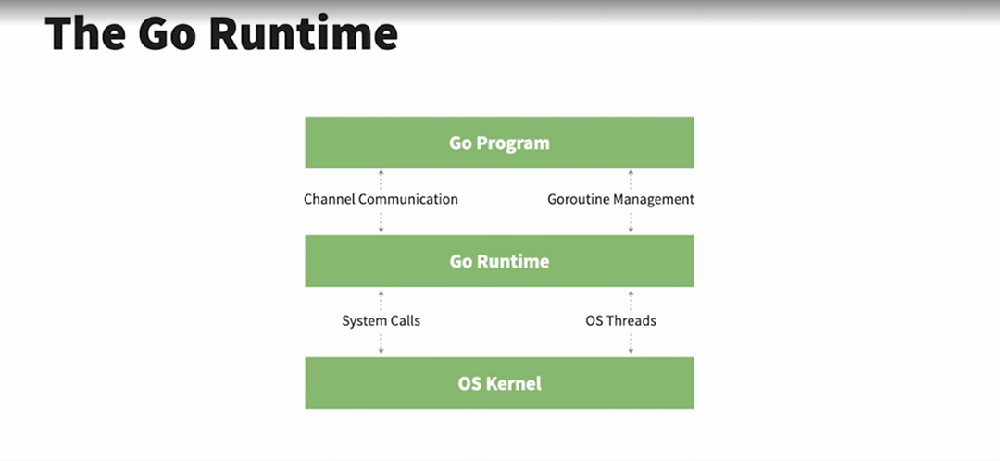
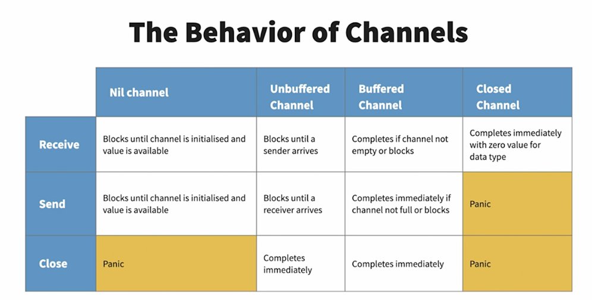

## Applied Concurrency in Go

### HTTP request/response cycle

On the internet, information is mostly exchanged via HTTP. The exchange begins with the client sending out an HTTP
request to the server to ask for information. If the server recognizes the request, it begins processing it by invoking
any backend code required to fulfill the request. The invoked functions are typically called _request handlers_. Once
the backend processing completes, the server finishes the information exchange by wrapping the information into an HTTP
response and sending it back to the client.

### Concurrency vs. Parallelism

**Parallel** events or tasks execute simultaneously and independently. True parallel events require multiple CPUs. Each
task runs in isolation from each other and uses all the resources it needs to accomplish its objective.


**Concurrent** tasks or events are interleaving and can happen in any given order. It is a non-deterministic way of
achieving multiple tasks. Concurrent tasks seem to happen simultaneously while in actual sense, they are being swapped
very quickly.


#### Examples of concurrent tasks in a typical computer

1. Running of background tasks for updates
2. Running the operating system
3. Writing information to the disk
4. Reading information from the disk
5. Swapping between multiple active applications

| Concurrency   | Parallelism   |
|---|---|
|  Dealing with a lot of things at once | Doing a lot of things at once   |
| Only a single thing is done at a time  |  Multiple things are done at the same time |
| Other new tasks are run during the idle periods of other running tasks  |  The tasks run independently and do not influence each other |

### The Go Runtime

In Go, concurrent tasks are called _goroutines_. Other programming languages have a similar concept called _threads_,
but goroutines require **_less computer memory_** than threads, and _**less time to start up and stop**_, meaning you
can run more goroutines at once.



#### Goroutines Exercise

In executing the `serialtaskexecution` without goroutines, the following output was realized:

- Linear serial task execution

````text
Done making hotel reservation.
Done booking flight tickets.
Done ordering a dress.
Done paying Credit Card bills.
Wrote 1/3rd of the mail.
Wrote 2/3rds of the mail.
Done writing the mail.
Listened to 10 minutes of audio book.
Done listening to audio book.
````

- Serial task execution using `goroutines`

However, when goroutines was used, the following output was realized:

````text
Done making hotel reservation.
Done booking flight tickets.
Done ordering a dress.
Done paying Credit Card bills.
Wrote 1/3rd of the mail.
Listened to 10 minutes of audio book.
````

This is because `goroutines` are not waited upon. The code in the `main` function continues executing and once the
control flow reaches the end of the main function, the program ends.

- Task execution using `sync.waitGroup`

When a `waitGroup` was used, the following output was realized (one of the possible ones).
`continueWritingMail1` and `continueWritingMail2` were executed at the end after `listenToAudioBook`
and `continueListeningToAudioBook`

```text
Done making hotel reservation
Done booking flight tickets
Done ordering a dress
Done paying Credit Card bills
Wrote 1/3rd of the mail.
Listened to 10 minutes of audio book.
Done listening to audio book.
Wrote 2/3rds of the mail.
Done writing the mail.
```

Adding `go` in-front of `task(&waitGroup)` enables the achievement of maximum concurrency by letting Go runtime
determine the order of execution of the tasks.

### Goroutines

These are independently executing functions that run on top of normal threads but lighter. They are therefore sometimes
referred to as `lightweight threads`.

1. They are independently executing functions
2. Sometimes referred to as lightweight threads
3. Run on top of threads
4. Outnumber threads by orders of magnitude
5. Runtime optimally schedules goroutines

### Methods of the sync.WaitGroup

- The `sync` package provides locks and synchronization primitives for use in concurrent programming. The WaitGroup is
  used to wait for a collection of goroutines to finish.
- It is a great way to wait for a set of concurrent operations to complete when you either don't care about the result
  of the concurrent operation, or you have other means of collecting their results.

  ```go
  func (wg *WaitGroup) Add(delta int)
  func (wg *WaitGroup) Done()
  func (wg *WaitGroup) Wait()
  ```

- `Add` adds a given number to the inner counter
- `Done` decrements the counter by 1 and is used to denote the completion of a goroutine
- `Wait` blocks the goroutine from which it is invoked until the counter reaches zero

NB: A good practice is to invoke the `Done` method as a deferred call at the beginning of the function to ensure it is
called.

### sync.Mutex and sync.RWMutex

- `Mutex` stands for _mutual exclusion_ and is simply a way to guard critical sections of a program.
- It is a mutually exclusive flag that acts as a gate-keeper to a section of code, allowing one thread in and blocking
  access to all others. This ensures that the code being controlled will only be hit by a single thread at a time.
- sync.Mutex `Unlock` should always be used within a `defer` statement. This ensures that the call always happens even
  when _panicing_. Failing to so can result into a program deadlock.

#### Critical sections

- A `critical section` is a group of instructions/statements or region of code that need to be executed atomically.
- They often reflect a bottleneck in a program and are relatively expensive to enter and exit these areas. There is
  therefore a general attempt to minimize the time spent in them. Enters `sync.RWMutex`.
- The `sync.RWMutex`, in addition to guarding access to memory, also offers control over the memory. That means, the
  request can be specific to reading memory, in which case, permission can be granted unless the lock is being held for
  writing. This means that an arbitrary number of readers can hold a reader lock so long as nothing else is holding a
  writer lock.

### Race conditions

- Race conditions occur when multiple goroutines read and write shared data without synchronization mechanisms.
- Race conditions create inconsistent results
- Problems often occur with a `check-then-act` operation.
- Go toolchain has a built-in race detector.

```text
go run -race server.go
```

### Synchronization primitives in Go

- Channels
- Mutexes
- r/w mutexes
- atomic operations

#### The sync.Map

- Safe for concurrent use by multiple goroutines
- Equivalent to a safe ```map[interface{}]interface{}```
- The zero value is empty and ready for use
- Incurs [performance](https://medium.com/@deckarep/the-new-kid-in-town-gos-sync-map-de24a6bf7c2c) overhead and should
  only be used as necessary

##### Using the sync.Map

  ```go
  func (m *Map) Load(key interface{}) (value interface{}, ok bool)
func (m *Map) Store(key, value interface{})
func (m *Map) Range(f func (key, value interface{}) bool)
  ```

- The `Load` method reads an existing item from the map and returns nil and false when value does not exist
- The `Store` method inserts or updates (upserts) a new key value pair
- The `Range` method which takes in a function and sequentially calls it for all the values in the map

#### The sync.Mutex

- The Mutex is initialized unlocked using `var m sync.Mutex`

  ```go
  func (m *Mutex) Lock()
  func (m *Mutex) Unlock()
  ```

- The `Lock` method locks the Mutex and will block until the Mutex is in an unlocked state The `Unlock` method unlocks
  the Mutex and allows it to be used by another goroutine

### Channels

- Channels are the pipes that connect concurrent goroutines. You can send values into channels from one goroutine and
  receive those values into another goroutine.
- The value proposition of `channels` in Go is that there is no need to pass values to the shared context of the main
  function. The channel acts as a pass-through.
- Channels is Go are first-class citizens and therefore can be used without importing any extra packages.
- The channel operator is the arrow operator `<-`.
- Channels are associated with a type and only the declared data type can be transported in them. The syntax to declare
  a channel of type T is ```ch := make(chan T```
- The zero value of channels is `nil`.
- Sending to a channel is done with `ch <- data`; the arrow points into the channel as data travels into it.
- Receiving is done with `data := <- ch` ; the arrow points away from the channel as data travels out of it.
- Channels send and receive operations are blocking; meaning that code execution will stop until the send or receive
  operation is successfully completed.


#### Channel buffering

- By default, channels are *unbuffered*, meaning that they will only accept sends (chan <- ) if there is a corresponding
  receive (<- chan) ready to receive the sent value.
- _Unbuffered channels_ are zero capacity channels which require both the sender and the receiver to be present to
  successfully complete operations.
- _Buffered channels_ accept a limited number of values without a corresponding receiver for those values. The channel
  below, for instance, will accept upto 3 values even without a receiving channel.
- Channels can therefore be used to support synchronous (unbuffered channels) and asynchronous (buffered channels)
  communication.
- One of the benefits of buffered channels is that they can act as a cheap in-memory queue thus decoupling producers
  from consumers.

  ```go
  messages := make(chan string, 3)
  ```

#### Channel directions

- Channels can either be unidirectional or bidirectional. Unidirectional channels can be `receive only` channels (<-chan
  T) or `send only` channels (chan<- T)
- It is a recommended practice to use unidirectional channels as they provide a very clear expectation of a channel's
  expected usage and provide type safety to our programs. They also help avoid confusion to other future engineers
  extending our code.

#### Closing channels

- Closing channels signals that no more values will be sent on it. The syntax for closing a channel is as shown below:
  ```go
  close(ch)
  ```
- Only bidirectional and send only channels can be closed. Attempting to close a `receive only` channel would case a
  compilation error.
- Senders panic when sending to a closed channel.
- Receivers immediately receive the zero value of the channel data type from a closed channel. This means that without
  checking whether a nil value came from a closed or open channel, it is possible to get erroneous data. This can be
  done as shown below:

  ```go
  func doWork(ch chan string) {
  data, ok := <-ch
  if !ok {
	  fmt.Println("Channel is closed")
	  return
   }
   fmt.Println("Channel is open:", data)
  }
  ```

The behavior of channels is summarized below:



#### The select statement

- The `select` statement lets a goroutine wait on multiple channel operations. These could be both send and receive
  operations.
- It blocks until one of the operations on its channels is ready.
- If multiple operations are ready, one of them is chosen at random.
- The select statement is similar to a `switch` statement.
  ```go
  func doWork(ch1, ch2 chan string) {
      for {
          select {
          case msg1 := <-ch1:
              fmt.Println("received from ch1", msg1)
          case msg2 := <-ch2:
              fmt.Println("received from ch1", msg2)
          default:
              fmt.Println("Nothing received")
          }
      }
  }
  ```

### Concurrency patterns

#### 1. Signalling that work is done

- This can be done by closing the respective channel where data was being sent. Sending data to a closed channel,
  however, causes a panic.
- A common pattern for gracefully shutting down work is to instead close an additional channel known as
  the `signal channel`. The sole purpose of this channel is to signal that work has been completed. Its data type is an
  empty struct so as to take as little memory as possible. This is shown below:

  ```go
  func doWork(input <-chan string, done <-chan struct{}) {
      for {
          select {
          case in := <-input:
              fmt.Println("Got some input", in)
          case <-done:
              return
          }
      }
  }
  ```
- Since attempting to close an already closed channel panics, we should therefore ensure that the done channel is only
  closed once. The package `sync` provides `sync.Once` which can be used as shown below:
  ```go
  func sayHelloOnce() {
      var once sync.Once
      for i := 0; i < 10; i++ {
          once.Do(func() {
              fmt.Println("Hello, world!")
          })
      }
  
  }
  ```

#### 2. Worker pools

The worker pools pattern allows us to scale up processing a task in a controlled manner.

#### 3. Contexts and cancellation

- Contexts in Go are generated by the HTTP package for each request. They can be accessed by using the context method.
- All contexts are immutable, meaning that if we want to make any changes, a new context will be generated, which we
  then need to interact with.Once a new context is made from another context, the first context becomes
  the `parent context` and the second context is the `derived context`.
- A context can be cancelled using any of the three ways: (1) A cancel function (2) A deadline (3) A timeout
- Cancelling a context automatically cancels all its derived contexts

```go
context.WithCancel(parent Context) (ctx Context, cancel CancelFunc)
context.WithDeadline(parent Context, deadline time.Time) (Context, CancelFunc)
context.WithTimeout(parent Context, teimout time.Duration) (Context, CancelFunc)
```

- `WithCancel` returns a new `Context` that closes its done channel when the returned cancel function is called.
- `WithDeadline` returns a new `Context` that closes its done channel when the machine's clock advances past the given
  deadline.
- `WithTimeout` returns a new `Context` that closes its done channel after the given timeout duration.

The syntax for using context cancellation is shown below:

  ```go
  func doWork(ctx context.Context, input <-chan string) {
for {
select {
case in := <-input:
fmt.Println("Got some input:", in)
case <-ctx.Done():
fmt.Println("Out of time!", ctx.Err())
return
}
}
}
  ```

##### 3.1. When should we use contexts?

- From the official Go [library](https://pkg.go.dev/context), contexts should only be used _for request-scoped data that
  transits processes and APIs, not for passing optional parameters to functions_.
- The following are five heuristics to consider when using contexts (as recommended Katherine Cox's _Concurrency in
  Go_):
    - [1] The data should transit process or API boundaries: If you generate the data in your process' memory, it may
      not be
      a good candidate to be request-scoped data unless it is also passed across an API boundary
    - [2] The data should be immutable
    - [3] The data should trend toward simple types
    - [4] The data should be data, not types with methods
    - [5] The data should help decorate operations, not drive them: If your algorithm behaves differently based on what
      is or isn't included it its Context, you have likely crossed over into the territory of optional parameters.

- Below is a table of common data and how they fulfil the above heuristics.

| **Data**                  | **1**   | **2**| **3**| **4**| **5**|
|-----------------------|-----|-----|-----|-----|-----|
| Request ID            |✓|✓|✓|✓|✓|
| User ID               |✓|✓|✓|✓||
| URL                   |✓|✓||||
| API Server Connection |||||
| Authorization Token   |✓|✓|✓|✓||
| Request Token         |✓|✓|✓|||

##### 3.2. Advantages of context

- Useful for passing request IDs from handlers further into the application for request tracing and debugging.
- Can be used to stop expensive operations from running unnecessarily. This is possible due to the propagated
  cancellation of derived contexts.
- They help in keeping the system latency down by providing an inbuilt hard stop.

#### 4. Replicated requests

- For certain applications, receiving a response as quickly as possible is the top priority. In such instances, one can
  replicate the request to multiple handlers (goroutines, processes or servers), and one of them will return faster than
  the other ones; you can immediately return the result.
- In this approach, it must be noted that all the handlers need to have _equal opportunity to service the request_. In
  other words, you are not going to have a chance at receiving the fastest time from a handler that can't service the
  request.
- A different symptom of the same problem is uniformity. If your handlers are too much alike, the chances that any one
  will be an outlier is smaller. You should only replicate out requests like this to handlers that have different
  runtime
  conditions: different processes, machines, paths to a data store, or access to different data stores altogether.
- Although this technique can be expensive to set up and maintain, if speed is the top most priority, it is a valuable
  technique that additionally provides _fault tolerance_ and _scalability_.

#### 5. Rate limiting

- Rate limiting refers to _constraining_ the number of times _some kind of resource_ is accessed to some finite number
  per unit of time.
- The benefits include:
    - Prevents entire classes of attack vectors against a system.
    - Prevents a legitimate user from _degrading_ the performance of the whole system and affecting other users or even
      causing _death-spirals_
- Even with only a single user, rate limits can be advantageous. A lot of the time, systems have been developed to work
  well under the common use case, but may begin behaving differently under different circumstances. This effect may
  cascade through the system and have drastic, unintended consequences.
- For instance, under a load, the system may begin _dropping packets_ causing the distributed system to _lose its
  quorum_ and stop accepting writes, effectively causing all the existing requests to fail. This is kind of a system
  performing a DDoS attack on itself.
- Rate limiting allows us to reason about the performance and stability of our system by preventing it from falling
  outside the boundaries already investigated.

##### 5.1. Token bucket

- Most rate limiting is implemented by using an algorithm known as _token bucket_.
- Assuming that to utilize a resource, you have to have an _access token_ for the resource. Without the token, your
  request is denied.
- Now imagine these tokens are stored in a bucket waiting to be retrieved for usage and the bucket has a depth of `d`,
  indicating that it can hold `d` access tokens at a time.
- Every time you access the resource, your tokens reduce by one up to a point when there is none and your request is
  either denied or queued until the tokens are replenished.
- In order to replenish the tokens, we could define a rate `r` at which the tokens are added back into the bucket. This
  is what is commonly referred to as _rate-limiting_.

##### 5.2. Example explanation

Without rate limiting, the API requests are fielded almost simultaneously. The clients are free to access the system as
frequently as they like.

```cmd
20:08:28 ReadFile
20:08:28 ResolveAddress
20:08:28 ResolveAddress
20:08:28 ResolveAddress
20:08:28 ResolveAddress
20:08:28 ResolveAddress
20:08:28 ReadFile
20:08:28 ReadFile
20:08:28 ResolveAddress
20:08:28 ReadFile
20:08:28 ReadFile
20:08:28 ReadFile
20:08:28 ReadFile
```

Upon implementing a rate limiter for the `ReadFile` endpoint, its requests are now completed only once every second.

```cmd
20:21:07 ReadFile
20:21:07 ResolveAddress
20:21:07 ResolveAddress
20:21:07 ResolveAddress
20:21:07 ResolveAddress
20:21:07 ResolveAddress
20:21:07 ResolveAddress
20:21:07 ResolveAddress
20:21:07 ResolveAddress
20:21:07 Done
20:21:07 ResolveAddress
```

#### 6. Queuing

- When we accept work for a pipeline even though it is not ready, we call this _queuing_.
- While introducing queuing into a system is very useful, it's usually one of the last techniques that should be
  considered.
- Adding queues prematurely can hide synchronization issues such as deadlocks and live-locks, and further, as a program
  converges toward correctness, more or less queuing may be needed.
- Queuing will almost never speed up the total runtime of a program; it will only allow the program to behave
  differently.
- The utility of a queue is not that reduces the runtime of a program but rather that it reduces its blocking
  state time. This allows the program to continue doing its work and instead of altogether blocking clients, will
  instead delay their requests.
- In this way, the true utility of a queue is to _decouple stages_ so that the runtime of one stage has no impact on the
  runtime of another. Decoupling stages in this manner then cascades to alter the runtime behaviour of the system as a
  whole, which can be either good or bad depending on the system in question.
- The following are some of the areas where a queue would be applicable:
    - If batching requests in a stage saves time
    - If delays in a stage produce a feedback loop into the system.

##### 6.1. Batching Example

- One example of a batching process is a stage that buffers input in something faster (e.g. memory) than it is designed
  to send to (e.g. disk). The example below demonstrates a simple comparison of a buffered write to a queue verses an
  unbuffered write.

  ```go
  func BenchmarkUnbufferedWrite(b *testing.B) {
      performWrite(b, tmpFileOrFatal())
  }
  func BenchmarkBufferedWrite(b *testing.B) {
      bufferredFile := bufio.NewWriter(tmpFileOrFatal())
      performWrite(b, bufio.NewWriter(bufferredFile))
  }
  func tmpFileOrFatal() *os.File {
      file, err := os.CreateTemp("", "tmp")
      if err != nil {
          log.Fatalf("error: %v", err)
      }
      return file
  }
  func performWrite(b *testing.B, writer io.Writer) {
      done := make(chan interface{})
      defer close(done)
      b.ResetTimer()
      for bt := range take(done, repeat(done, byte(0)), b.N) {
          writer.Write([]byte{bt.(byte)})
      }
  }
  ```

- Buffered write is much faster that the unbuffered write because in `bufio.Writer`, the writes are queued internally
  into a buffer until a sufficient chunk has been accumulated, and the chunk is written out, in a process known as _
  chunking_.
- Chunking is faster because `bytes.Buffer` must grow its allocated memory to accommodate the bytes it must store.
- For various reasons, growing memory is expensive; therefor, the less times we have to grow, the more efficient our
  system as a whole will perform.
- Generally, anytime performing an operation requires an overhead, chunking may increase system performance. Some
  examples of this are:
    - Opening database transactions
    - Calculating message checksums
    - Allocating contiguous space
- Aside from chunking, queuing can also help if your algorithm is optimized by supporting lookbehinds, or ordering.
- The following some _batching strategies_ that can be used:
    - Number of messages can be reduced by combining multiple messages into fewer batched messages.
    - Data can be split up and transferred into shorter batches if waiting for all the data is the cause of the delay in
      response time.
    - Data requirements can be anticipated, and extra data can be transferred in batches together with the data that is
      needed at that moment, in anticipation of the extra data to be needed soon.

##### 6.2. Little's Law

- In queuing theory, there is a low that-with enough sampling-predicts the througghput of u=your pipeline. It's called _
  Little's Law_.
- It's commonly expressed as: L=λW where
    - L = the average number of units in the system
    - λ = the average arrival rate of units
    - W = the average time a unit spends in the system
- The equation only applies to so-called _stable_ systems, one in which the rate that works enters the pipeline, or _
  ingress_ is equal to the rate at which it exits the system, or _egress_.
- If the rate of ingress exceeds the rate of egress, a system is said to be _unstable_ and has entered a _death-spiral_.
- If the rate of ingress is less than the rate of egress, the resources into a system are being _underutilized_ and the
  system is still considered unstable.

### References

1. Java Performance Tuning, _Jack Shirazi_
2. Concurrency in Go: Tools and Techniques for Developers, _Katherine Cox-Buday_

